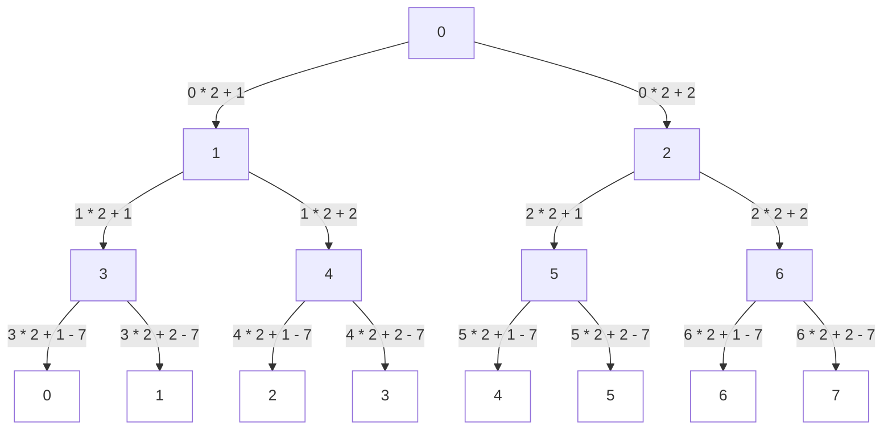
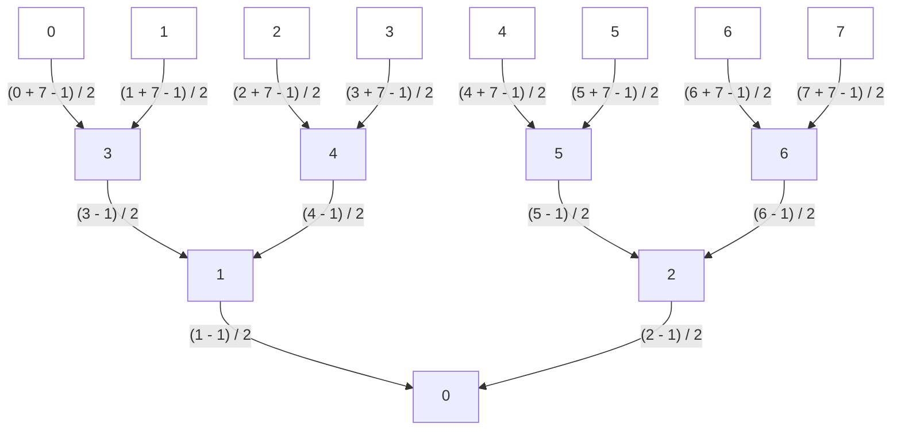

# Traversing

## Top-down

### Traversing at tree

left_child = i*2 + 1

right_child = i*2 + 2

### Traversing from tree to the plain data

shift = 3

shift_down = 7

left_child = i*2 + 1 - shift_down

right_child = i*2 + 2 - shift_down

## Down-top

### Traversing at tree

parent = (i - 1) / 2

### Traversing from tree to the plain data

shift = 3

shift_down = 7

parent = (j + shift_down - 1) / 2
