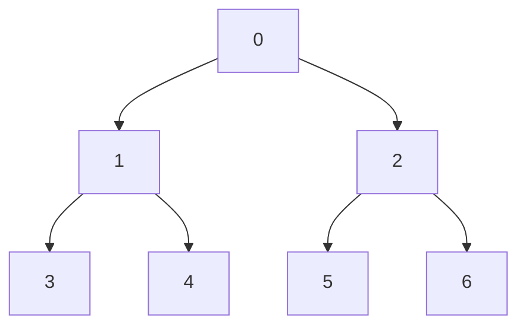
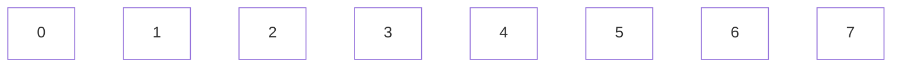

# Tree

## Classic segment tree structure

## Used format

Tree:

And plain data:

Let's define 'shift' value as an index of the left-bottom node of a given tree.
For this case, 'shift' equals to 3.

Also, we can define 'shift_up' and 'shift_down' operations.

shift_up = shift / 2

shift_down = shift * 2 + 1
